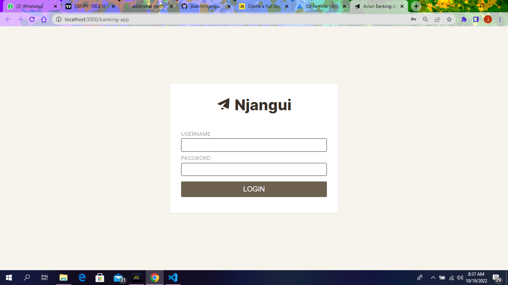

# Njangui app in ReactJS



The admin of the group admits users into the njangui

He also does the withdrawal and deposit manually for each account.
He also does the transfer of balances if there are requests for it.

The normal njangui group member has user status

[Live demo of Banking App](https://github.com/jikalvin/njangui-app.git)

## Objective
A njangui app created with ReactJS.

## Demo Account Credentials

Use the following credentials to test the app.

### For Admin
```
email: admin@admin.com
password: abc123
```

### For Client
```
email: client@client.com
password: abc123
```

[Live demo of Banking App](https://github.com/jikalvin/njangui-app.git)
